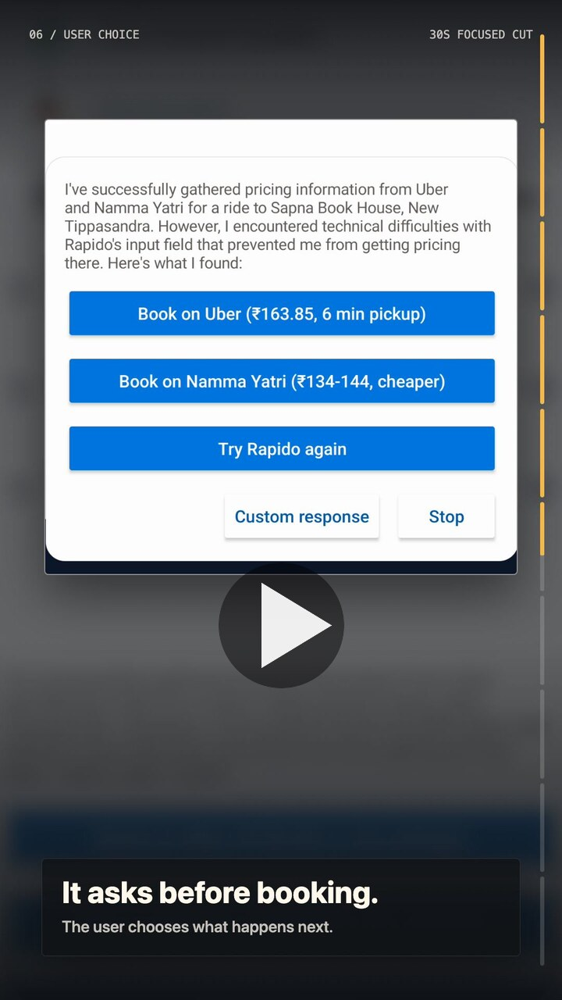

# Claune Android

Claune Android is a prototype app for a phone-control agent. The user gives it a task by voice or text, and the app runs an agent on the phone. The agent observes and controls the real device through Android accessibility APIs.

This repo is for local development, live demos, and debugging on a known Android 12+ device. It is not a distribution build.

## Demo

<a href="https://youtube.com/shorts/VFWJvzwVIco">
  
</a>

[Watch the demo on YouTube Shorts](https://youtube.com/shorts/VFWJvzwVIco)

## Current state

- Jetpack Compose app with a soft-kraft UI, a session list, a session detail screen, and settings.
- Voice input through Android `SpeechRecognizer`, plus typed input.
- API key storage in app settings, backed by DataStore.
- Foreground service for active agent work.
- AccessibilityService bridge for phone observation and actions.
- Accessibility overlay for status, steering, stopping, and replying while Claune is working over other apps.
- Persistent session history through `pi-agent-kotlin`.
- One active foreground run at a time. A user can keep a session and send later follow-up tasks into it.
- Model execution backed by the published `pi-agent-kotlin` `0.1.0` artifacts, with Anthropic and Gemini model options.
- `execute_script` as the only model-facing phone-control tool.
- Run-outcome and user-decision tools for `finish_run` and `ask_user`.
- Memory reflection after completed or blocked turns, with `read_memory` and `edit_memory` tools for saved notes.
- Local run artifacts under app storage: prompts, compact screen records, latest raw screen state, script calls, agent messages, events, and memory-reflection output.

## Boundaries

- This is not a Play Store build.
- It is not a broad personal assistant.
- It is not multi-agent.
- It does not have production-grade auth, safety, or account management.
- It does not mirror the live phone. The user sees the real phone; Claune is the control and status layer.

## Repository layout

- `android/app`: the Android app, foreground service, accessibility service, overlay, runtime shell, UI, tests, and local storage.
- `android/gradle/libs.versions.toml`: dependency versions, including the published `pi-ai-core`, `pi-agent-core`, and `pi-coding-agent-core` artifacts.
- `docs/`: architecture and stack notes for the current prototype direction.

## Requirements

- macOS or Linux, with Android platform tools.
- JDK 17.
- Android Studio or the Android SDK installed locally.
- A connected Android device or emulator. The current test device is Android 12 / API 31 or newer.
- An API key for the model you want to run: Anthropic for Claude Haiku, or Gemini for `gemini-3.1-flash-lite-preview`.
- Accessibility access enabled for Claune before phone control will work.
- Microphone permission if you want voice input.

## Setup

Create `android/local.properties` if it does not exist, then add your local Android SDK path. You can also add development API keys there:

```properties
sdk.dir=/path/to/android/sdk
claune.anthropicApiKey=sk-ant-...
claune.geminiApiKey=...
```

You can also add or replace API keys from the app's Settings screen. The build still reads the `claune.*ApiKey` values as local development defaults.

Optional LangSmith tracing for debug builds can also be enabled from `android/local.properties`:

```properties
claune.telemetry.enabled=true
claune.langsmith.apiUrl=https://api.smith.langchain.com
claune.langsmith.project=claune
claune.langsmith.apiKey=lsv2_pt_...
```

Keep the LangSmith key local and rotate it if it has been pasted into chat or logs. This debug path exports directly from the app through LangSmith's native Runs API; use a collector or proxy before treating it as production telemetry.

LangSmith traces use a root `chain` run named from the user prompt, `agent.step` chain children for the incremental story, `llm` children for exact provider calls, and `tool` children for exact tool executions. LLM runs store the full provider context in `inputs.messages`, the step delta in `inputs.delta_messages`, structured assistant output in `outputs.messages`, and token/cost data in `outputs.usage_metadata`. Query conversations through `metadata.thread_id` and individual runs through `metadata.claune_run_id`.

Install a debug build:

```sh
cd android
./gradlew installDebug
```

On the device:

1. Open Claune.
2. Add the API key for your selected model in Settings if it was not provided through `local.properties`.
3. Open Android Accessibility settings from the app and enable Claune.
4. Grant microphone permission when prompted, if you use voice input.

Avoid force-stopping the app during live accessibility testing. On this device setup, force-stop can clear or disrupt the accessibility-service state.

## Common commands

```sh
cd android
./gradlew formatCode
./gradlew qualityCheck
./gradlew testDebugUnitTest
./gradlew check
./gradlew assembleDebug
./gradlew installDebug
```

Notes:

- `qualityCheck` runs ktlint checks and Android lint.
- `check` also runs the app module's configured checks.
- `assembleDebug` and `installDebug` depend on `testDebugUnitTest` in this repo, so a debug build also runs unit tests.

## Debugging on a device

Start the app with a message:

```sh
adb shell "am start -a com.divyanshgolyan.claune.android.DEBUG_AUTOSTART -n com.divyanshgolyan.claune.android/.ui.MainActivity --es extra_autostart_message 'open settings and tell me what you see'"
```

Show the overlay without starting an agent run:

```sh
adb shell "am start -n com.divyanshgolyan.claune.android/.ui.MainActivity --ez extra_debug_overlay true"
```

Check whether Claune's accessibility service is enabled:

```sh
adb shell settings get secure enabled_accessibility_services
```

Dump Claune's current semantic screen state:

```sh
adb shell am broadcast -n com.divyanshgolyan.claune.android/.debug.DebugSnapshotReceiver -a com.divyanshgolyan.claune.android.debug.DUMP_SNAPSHOT
adb exec-out run-as com.divyanshgolyan.claune.android cat files/debug-screen-state.json > /tmp/claune-debug-screen-state.json
adb exec-out run-as com.divyanshgolyan.claune.android cat files/debug-raw-tree.json > /tmp/claune-debug-raw-tree.json
```

Use `debug-screen-state.json` to see the semantic tree that backs `observeScreen()`, `diffScreen()`, and `inspectScreen()`. Use `debug-raw-tree.json` when a control is visible to a user but Claune cannot activate it; it captures the same full `ScreenState` shape, including bounds, exposed accessibility actions, and parent/descendant click fallback hints. This broadcast only works in debug builds.

If Droidrun Portal is installed on the same device, its content provider can show the current phone state while debugging:

```sh
adb shell content query --uri content://com.droidrun.portal/phone_state
```

Benchmark the interaction projection against a real persisted phone snapshot:

```sh
scripts/run_projection_benchmark.sh --pull
```

The script pulls the latest `latest-screen-state.json` from the newest on-device run and replays it through `ScreenState.toInteractionObservationPayload()` in a local JVM test. It writes a JSON report to `android/build/reports/projection-benchmark.json`. Override the input or sample count with:

```sh
CLAUNE_PROJECTION_FIXTURE=/path/to/latest-screen-state.json CLAUNE_PROJECTION_ITERATIONS=50 scripts/run_projection_benchmark.sh
```

## Current agent contract

The model should observe and act through `execute_script`. The JavaScript host exposes the `claune` API for phone observation, targeted screen inspection, tapping, typing, scrolling, back/home, and waiting for UI state. The model should not invent raw Android objects or reuse stale element ids.

The normal `observeScreen()` result stays compact. It returns either canonical screen text or a canonical diff from the previous screen state. If a target is visible but `tapText`, `tapSelector`, or `tapRef` cannot match an actionable element, the model should call `inspectScreen({ text: "target text" })`. That inspection returns bounded visible elements, including non-clickable text nodes, with center coordinates, exposed accessibility actions, clickability reasons, and `tapFallbackEligible`.

If an expected target should exist but the compact screen summary and `inspectScreen()` do not surface it, use `findRawNodes({ pattern: "book|confirm|request|continue" })`. This searches the latest raw accessibility tree inside the host and returns only bounded matches with refs, bounds, context labels, and nearest actionable targets; it does not dump the whole tree back into the model context.

Coordinate tapping is a fallback. The model should use `tapBounds(candidate.bounds)` only after `inspectScreen` shows the requested target as a visible bounded element. After any coordinate tap, it must call `observeScreen()` and verify an observable change tied to the requested target. `tapPoint(x, y)` exists for low-level debugging, but `tapBounds` is preferred because the host computes the center point.

When a run ends, the model records one terminal outcome through a tool call:

- `finish_run` with status `completed` after the requested outcome is verified on the phone.
- `finish_run` with status `blocked` when progress is impossible, unsafe, or only partially complete.
- `ask_user` when the run needs a user decision before it can continue. The overlay presents 1 to 3 options and also allows custom input.

Completed or blocked runs do not close the user-owned session by themselves. The overlay and foreground session can stay up so the user can continue, steer, or stop explicitly.

## Status

This is a personal prototype repo with no public support process yet. There is no root license file at the moment.
